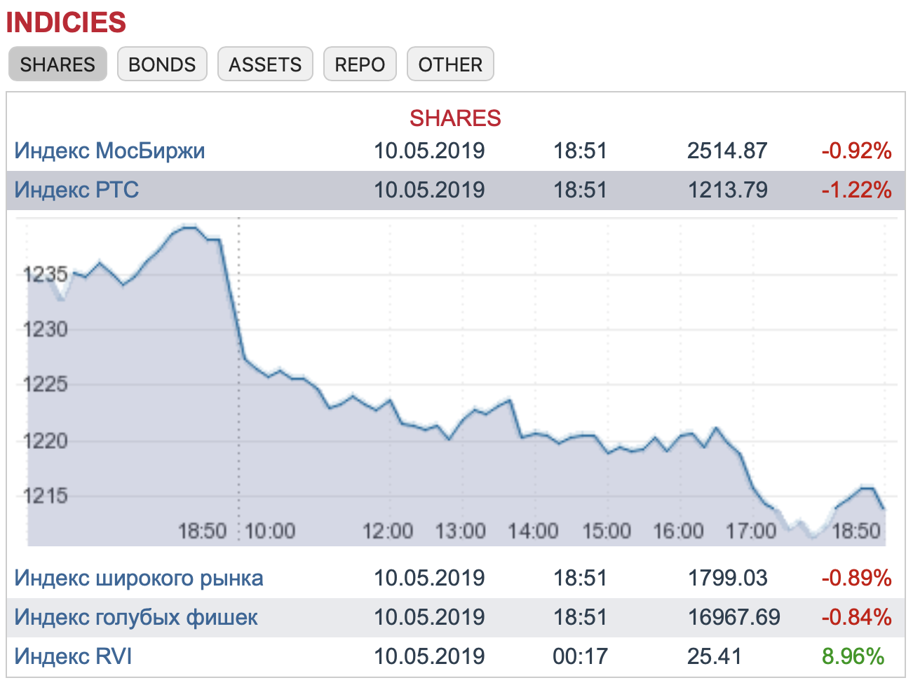

# Vue Stock Widget

The project is an simple Vue.js implementation of the widget similar to the posted on the Moscow Exchange home page [www.moex.com](https://www.moex.com/).

## Usage



You are able to embed the widget on your site and customize it. Just edit JSON file in src/assets directory defining tabs and filling them with index codes which you want. Stock information will be uploaded by these codes via Moscow Exchange API. You can get the index codes on the Moscow Exchange website or using queries described in the API [documentation](http://iss.moex.com/iss/reference/).

## Dependencies

* [vue](https://github.com/vuejs/vue)
* [axios](https://github.com/axios/axios)
* [moment](https://github.com/moment/moment)
* [webpack](https://github.com/webpack/webpack)

## Installation

``` bash
# install dependencies
npm install

# serve with hot reload at localhost:8080
npm run dev

# build for production with minification
npm run build
```

For detailed explanation on how things work, consult the [docs for vue-loader](http://vuejs.github.io/vue-loader).

## Author

Developed by [alxiw](mailto:alxiw@ya.ru)

## License

[MIT](LICENSE)


