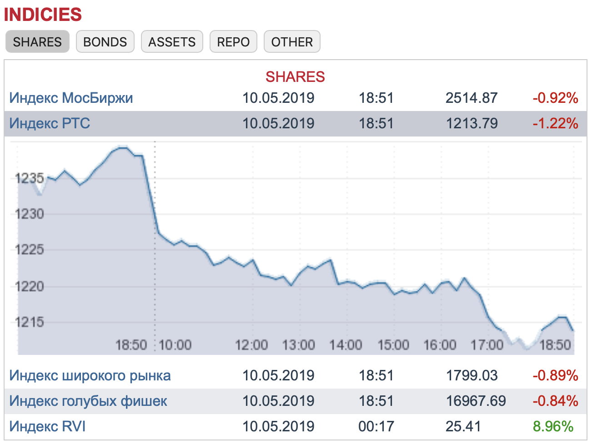

# Vue Stock Widget

A Vue.js stock widget based on the [Moscow Exchange (MOEX)](https://www.moex.com) design.

## Usage

Embed the widget on your site and customize it by editing a JSON config file in `src/assets/`, defining tabs and filling them with the index codes you want to display. Stock data is fetched via the Moscow Exchange API. You can find index codes on the MOEX website or using the queries described in the [API documentation](http://iss.moex.com/iss/reference/).



## Installation

``` bash
# install dependencies
npm install

# serve with hot reload at localhost
npm run dev

# build for production with minification
npm run build
```

## Dependencies

* [vue](https://github.com/vuejs/vue)
* [typescript](https://github.com/Microsoft/TypeScript)
* [axios](https://github.com/axios/axios)
* [vite](https://github.com/vitejs/vite)

## License

[MIT](LICENSE) © [alxiw](mailto:alxiw@outlook.com)
